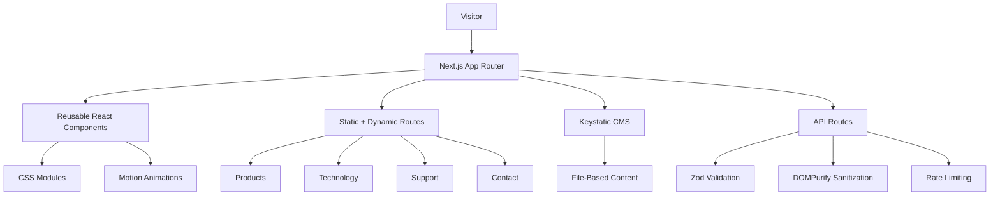

<div align="center">

# BITSOTRON

### Offline-First Digital Access Infrastructure

An enterprise-grade product website for a local Wi-Fi based mini data center platform that delivers digital content without public internet dependency.

<br />


</div>

---

## Project Identity

**BITSOTRON** is positioned as a plug-and-play offline digital access system for environments where internet connectivity is unreliable, costly, restricted, or unavailable.

The website presents BITSOTRON as a serious infrastructure product for:

- Education and training centers
- Healthcare camps and field programs
- Rural digital access initiatives
- Events and exhibitions
- Retail and product catalog delivery
- Agriculture and field operations
- Industrial teams and internal training

The goal of the project is not just to look modern. It is to communicate trust, clarity, and product readiness for a technical startup.

---

## Portfolio Objective

This project was designed and engineered as a polished portfolio-grade website that demonstrates:

- Product strategy and positioning
- Premium UI/UX execution
- Modern React and Next.js architecture
- CMS-backed content management
- Responsive layout systems
- Secure form handling
- Scalable component organization
- Professional brand consistency

It combines startup landing page storytelling with production-oriented implementation.

---

## Product Problem

Many organizations need to distribute digital content in locations where internet access is weak, expensive, blocked, or completely unavailable.

Common pain points include:

- Training materials that cannot load reliably
- Event visitors struggling to access forms or catalogs
- Rural users depending on unstable mobile networks
- Healthcare and field teams needing local access to guides
- Schools requiring offline video and document libraries
- Businesses needing controlled content delivery without cloud dependency

---

## Product Solution

BITSOTRON creates a local digital access layer.

Users connect to the BITSOTRON device over local Wi-Fi and open a browser-based portal to access:

- Videos
- Documents
- Forms
- Product catalogs
- Guides
- Dashboards
- Training content
- Operational resources

No public internet is required for the end user experience.

---

## Experience Design

The interface is built around a professional enterprise visual system:

| Design Area | Direction |
| --- | --- |
| Brand Palette | Dark Grey `#262626` with Yellow Gradient `#FC9700 → #FCBD00` |
| Typography | Aptos, Segoe UI Variable, Segoe UI, and native system fallbacks |
| Layout | Spacious, section-led, conversion-focused |
| Motion | Subtle UI feedback and controlled product storytelling |
| Surfaces | Clean cards, soft depth, glass-inspired panels |
| UX Priority | Fast comprehension, clear CTAs, mobile usability |

The visual direction avoids noisy gradients, decorative overload, and unprofessional display typography. The final result is restrained, sharp, and presentation-ready.

---

## System Architecture



---

## Core Features

### Product Website

- High-impact homepage with product positioning
- Clear product and technology pages
- Responsive navigation
- Professional call-to-action flow
- Offline-first messaging
- Removed unnecessary customer route to simplify the journey

### Content Management

- Git-based CMS using Keystatic
- Structured product content
- Singleton content for key pages
- File-based content storage
- No external database required

### Interaction Design

- Motion-enhanced hero section
- Interactive architecture storytelling
- Hover and focus states
- Reduced-motion support
- Keyboard-accessible controls

### Forms and APIs

- Contact form API
- Support ticket API
- Newsletter API
- Zod request validation
- DOMPurify sanitization
- Basic request rate limiting

---

## Technology Stack

| Layer | Tools |
| --- | --- |
| Frontend Framework | Next.js 14 App Router |
| Language | TypeScript |
| UI Layer | React |
| Styling | CSS Modules, CSS Custom Properties |
| Animation | Motion |
| CMS | Keystatic |
| Validation | Zod |
| Sanitization | DOMPurify, Isomorphic DOMPurify |
| Icons | Lucide React |
| Hosting Target | Vercel-ready |

---

## Route Structure

```text
/
├── about
├── products
│   └── [slug]
├── technology
├── support
├── contact
├── security
├── privacy
├── terms
├── cookies
└── keystatic
```

The `/customers` route was intentionally removed from the active navigation and route tree to keep the site focused on product discovery, technical credibility, support, and conversion.

---

## Repository Structure

```text
BITSOTRON/
├── app/
│   ├── api/
│   │   ├── contact/
│   │   ├── newsletter/
│   │   ├── ticket/
│   │   └── keystatic/
│   ├── about/
│   ├── contact/
│   ├── products/
│   ├── security/
│   ├── support/
│   ├── technology/
│   ├── layout.tsx
│   └── page.tsx
│
├── components/
│   ├── chat/
│   ├── layout/
│   ├── sections/
│   └── ui/
│
├── content/
│   ├── case-studies/
│   ├── industries/
│   ├── partners/
│   ├── positions/
│   ├── products/
│   ├── singletons/
│   ├── team/
│   └── testimonials/
│
├── lib/
│   ├── keystatic.ts
│   ├── rate-limit.ts
│   └── zod-schemas.ts
│
├── public/
├── styles/
│   ├── globals.css
│   └── utilities.css
│
├── keystatic.config.ts
├── next.config.js
├── package.json
└── tsconfig.json
```

---

## Selected Implementation Decisions

### Brand Consistency

The site uses a strict visual palette:

```css
--color-dark: #262626;
--gradient-primary: linear-gradient(90deg, #FC9700 0%, #FCBD00 100%);
```

This keeps the interface aligned with BITSOTRON’s brand assets and avoids distracting multi-color gradients.

### Professional Typography

The original display-heavy typography was refined into a calmer enterprise system:

```css
--font-family-base: 'Aptos', 'Segoe UI Variable', 'Segoe UI', system-ui, sans-serif;
--font-family-display: 'Aptos Display', 'Segoe UI Variable Display', 'Aptos', system-ui, sans-serif;
```

Headings use tighter hierarchy, moderate weights, and balanced line heights for a more credible product feel.

### Focused Navigation

The navigation prioritizes:

- About
- Products
- Technology
- Support
- Contact

This reduces cognitive load and keeps the journey aligned with product discovery and conversion.

### CMS-First Content

Keystatic allows product and page content to be edited through a local admin interface while keeping all data inside the repository.

---

## Setup

### Install Dependencies

```bash
npm install
```

### Start Development Server

```bash
npm run dev
```

### Build for Production

```bash
npm run build
```

### Start Production Build

```bash
npm run start
```

---

## Environment Variables

```env
RESEND_API_KEY=
ZENDESK_SUBDOMAIN=
ZENDESK_API_TOKEN=
ZENDESK_EMAIL=
NEXT_PUBLIC_CRISP_WEBSITE_ID=
```

| Variable | Purpose |
| --- | --- |
| `RESEND_API_KEY` | Enables contact form email delivery |
| `ZENDESK_SUBDOMAIN` | Zendesk workspace subdomain |
| `ZENDESK_API_TOKEN` | Zendesk API authentication |
| `ZENDESK_EMAIL` | Zendesk account email |
| `NEXT_PUBLIC_CRISP_WEBSITE_ID` | Enables Crisp live chat |

---

## Quality and Security

Implemented baseline safeguards:

- TypeScript for type safety
- Zod schemas for API validation
- DOMPurify for form data sanitization
- Basic rate limiting for form endpoints
- Security headers configured in `next.config.js`
- Accessible focus states
- Reduced-motion handling
- Responsive layout behavior

Recommended production hardening:

- Replace in-memory rate limiting with Redis or edge-compatible storage
- Upgrade vulnerable dependencies reported by `npm audit`
- Add automated accessibility checks
- Add end-to-end form tests
- Connect production email and support services

---

## Portfolio Highlights

- Designed and developed a complete startup website from concept to production-ready implementation
- Built a scalable Next.js App Router structure with reusable components
- Created a brand-aligned design system using CSS custom properties
- Integrated Keystatic for maintainable Git-based content editing
- Implemented secure, validated API workflows for user submissions
- Refined typography, navigation, and route structure based on UI/UX review
- Delivered a responsive interface suitable for product demos and investor-facing presentation

---

## What This Project Demonstrates

This project demonstrates the ability to combine:

- Product thinking
- Visual design systems
- Frontend engineering
- CMS architecture
- Accessibility-aware UI
- Security-conscious API design
- Real-world startup positioning

It is structured as a professional portfolio project that shows both design judgment and implementation depth.

---

<div align="center">

### BITSOTRON

**Offline access. Local control. Digital delivery anywhere.**

</div>
